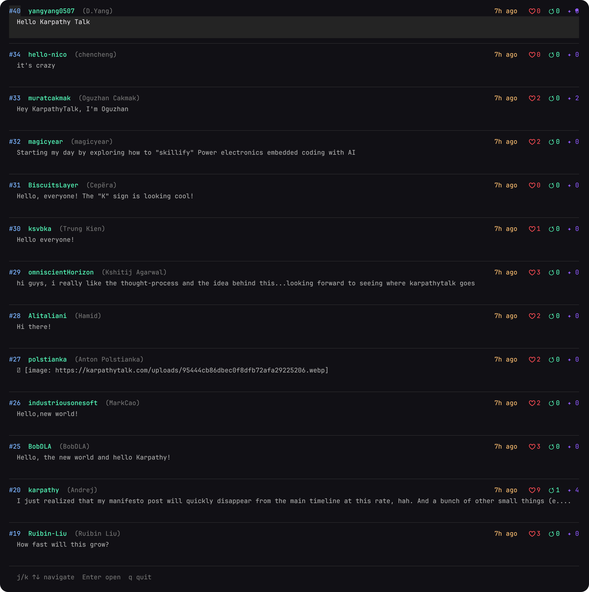
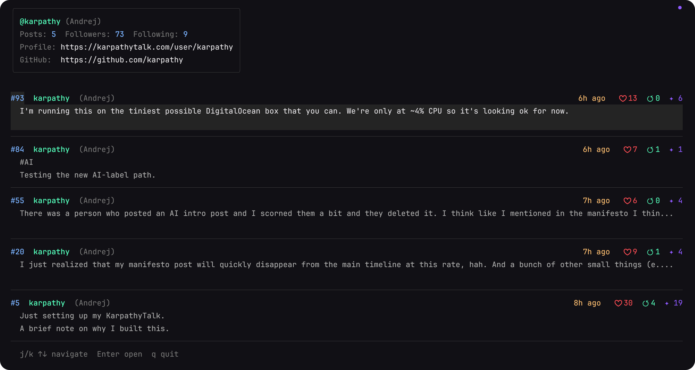
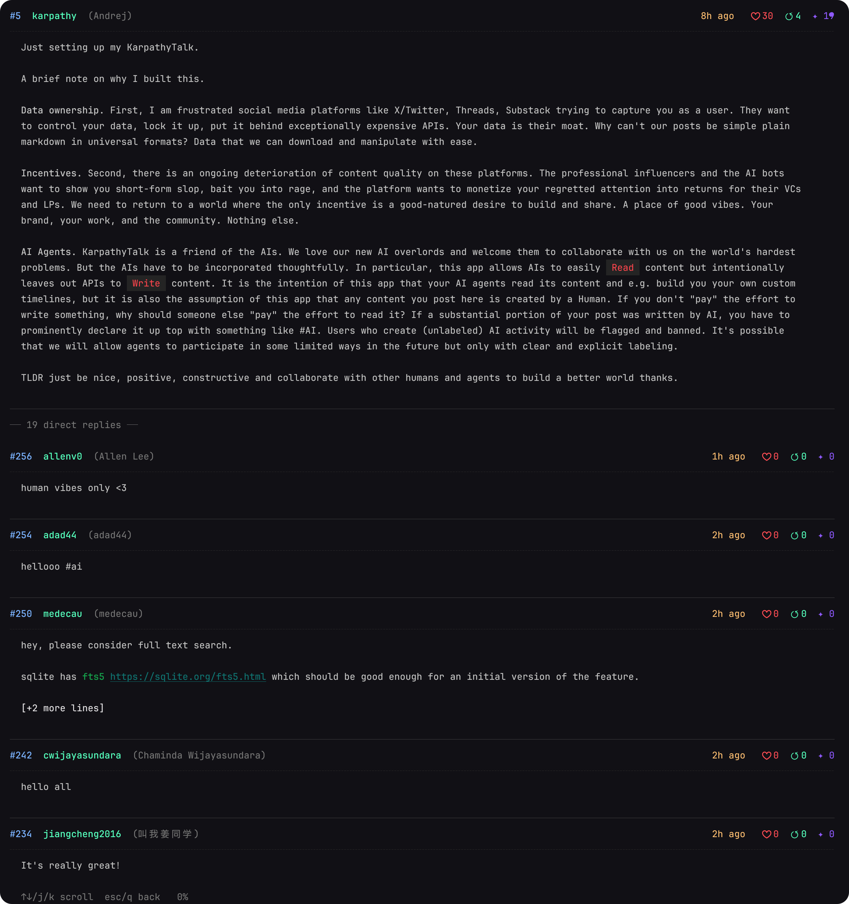

# kt — KarpathyTalk CLI

A read-only command-line client for [KarpathyTalk](https://karpathytalk.com), Andrej Karpathy's social platform. Browse the timeline, read posts, and explore user profiles — all from your terminal.

## Screenshots

<table>
  <tr>
    <th align="center">Timeline</th>
    <th align="center">User</th>
    <th align="center">Post</th>
  </tr>
  <tr>
    <td></td>
    <td></td>
    <td></td>
  </tr>
</table>

## Features

- **Interactive TUI** — Navigate posts with keyboard shortcuts when running in a terminal
- **Three output modes** — Human-friendly display, JSON, and Markdown for scripting and LLM pipelines
- **Unix-composable** — Pipe JSON or Markdown output into any tool
- **Pagination** — Scroll through large result sets with cursor-based pagination
- **Responsive** — Adapts to terminal width automatically

## Installation

**One-line install** (macOS / Linux):

```bash
curl -fsSL https://raw.githubusercontent.com/yangyang0507/KarpathyTalk-CLI/main/install.sh | sh
```

The script detects your OS and architecture, downloads the correct binary from the [latest release](https://github.com/yangyang0507/KarpathyTalk-CLI/releases/latest), and installs it to `/usr/local/bin` (or `~/.local/bin` if write permission is unavailable).

**Or build from source** (requires Go 1.26.1+):

```bash
git clone https://github.com/yangyang0507/KarpathyTalk-CLI.git
cd KarpathyTalk-CLI

make build          # → dist/kt  (current platform)
make install        # → $GOPATH/bin/kt
make release        # → dist/kt-<os>-<arch> for all platforms
```

## Usage

```
kt [--host <url>] <command> [flags]
```

Get help at any level:

```bash
kt help                  # list all commands
kt help timeline         # flags and examples for a specific command
kt timeline --help       # same as above
kt --version             # print installed version
```

### Commands

#### `kt timeline`

Browse the public timeline (root posts only).

```bash
kt timeline
kt timeline --limit 50
kt timeline --before 230       # load posts before ID 230
kt timeline --json             # output raw JSON
kt timeline --markdown         # output Markdown
```

| Flag | Default | Description |
|------|---------|-------------|
| `--limit <n>` | 20 | Posts per page (max 100) |
| `--before <id>` | — | Pagination cursor |
| `--json` | — | Output raw JSON |
| `--markdown` | — | Output post content as Markdown |

---

#### `kt user <username>`

View a user's profile and their posts.

```bash
kt user karpathy
kt user karpathy --replies     # show replies instead of root posts
kt user karpathy --json
kt user karpathy --markdown    # profile Markdown with YAML frontmatter
```

| Flag | Default | Description |
|------|---------|-------------|
| `--replies` | — | Show replies instead of root posts |
| `--limit <n>` | 20 | Posts per page |
| `--before <id>` | — | Pagination cursor |
| `--json` | — | Output raw JSON |
| `--markdown` | — | Output user profile Markdown |

---

#### `kt post <id>`

View a single post and its direct replies.

```bash
kt post 231
kt post 231 --json
kt post 231 --markdown         # post with YAML frontmatter
kt post 231 --raw              # raw Markdown, no frontmatter
kt post 231 --revision 2       # view a specific revision
```

| Flag | Default | Description |
|------|---------|-------------|
| `--limit <n>` | 20 | Replies per page |
| `--json` | — | Output post + replies as JSON |
| `--markdown` | — | Post Markdown with YAML frontmatter |
| `--raw` | — | Raw post Markdown (no frontmatter) |
| `--revision <n>` | — | View a specific revision (with `--markdown` / `--raw`) |

---

#### `kt docs`

Fetch the KarpathyTalk API documentation as Markdown. Useful for LLM context.

```bash
kt docs
kt docs | llm "summarize the API"
```

---

### Global Flags

| Flag | Default | Description |
|------|---------|-------------|
| `--host <url>` | `https://karpathytalk.com` | API root URL |

Useful for pointing at a local instance:

```bash
kt --host http://localhost:8080 timeline
```

## TUI Keyboard Shortcuts

When running in a terminal (TTY), `kt timeline`, `kt user`, and `kt post` launch an interactive TUI.

**List view:**

| Key | Action |
|-----|--------|
| `j` / `↓` | Move down |
| `k` / `↑` | Move up |
| `Enter` | Open post |
| `q` / `Ctrl+C` | Quit |

**Detail view:**

| Key | Action |
|-----|--------|
| `j` / `↓` | Scroll down |
| `k` / `↑` | Scroll up |
| `Esc` / `q` | Back to list |

The list auto-loads more posts when you approach the end.

## Output Modes

| Mode | When | Use case |
|------|------|----------|
| TUI | stdout is a TTY, no format flag | Interactive browsing |
| Human | stdout is piped, no format flag | Readable plain-text output |
| `--json` | Always | Scripts, `jq`, structured data |
| `--markdown` | Always | LLM pipelines, export, archival |

All errors go to stderr. JSON and Markdown outputs write only to stdout, making them safe to pipe.

## Examples

```bash
# Read the latest posts interactively
kt timeline

# Export recent posts to a Markdown file
kt timeline --markdown > posts.md

# Feed a post to an LLM
kt post 231 --raw | llm "summarize this"

# Get structured data
kt user karpathy --json | jq '.posts[].like_count'

# Pipe to a pager
kt timeline | less
```

## Design Philosophy

- **Read-only by design** — No authentication, no write operations.
- **Everything is a post** — Replies, quotes, and timelines are all posts with different filters.
- **Content is portable** — The server expands relative URLs to absolute URLs in Markdown.
- **Unix composability** — Every output mode is pipeable; JSON and Markdown are pure and clean.
- **Minimal dependencies** — Built on the Charmbracelet ecosystem (Bubble Tea, Glamour, Lipgloss) and the Go standard library.
